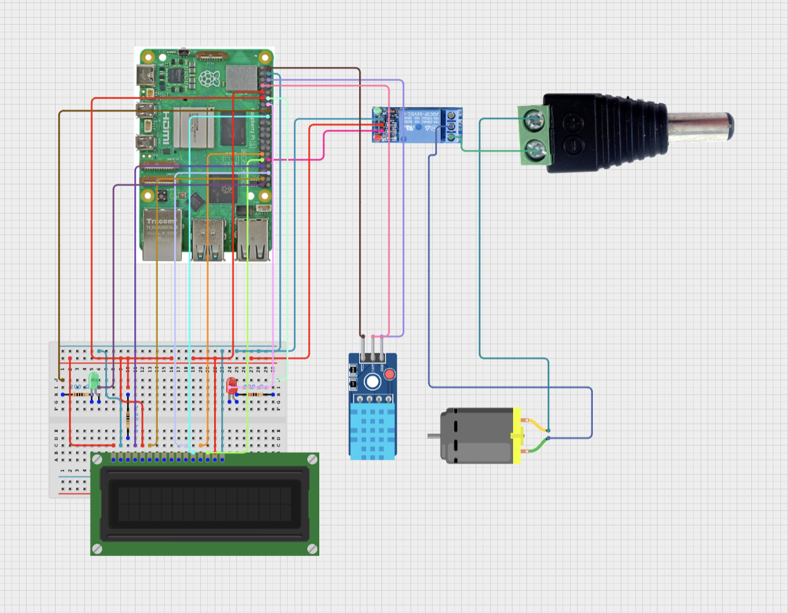

# 🌡️ Raspberry Pi Temperature-Controlled System

A Python-based Raspberry Pi project that monitors temperature using the DHT11 sensor and controls a motor and LEDs based on configurable thresholds. Output is displayed in real-time on a 16x2 LCD.

## 📽️ Demo Video

🎥 **Watch the demo**  

[▶️ Click here to view demo video](https://drive.google.com/file/d/1rGejXRGhs53z7bBM5AtFe6JSkQqzczKH/view?usp=sharing)

## 📐 Schematics




## 🔧 Components Used

- Raspberry Pi
- DHT11 Sensor
- 16x2 LCD
- Red & Green LEDs
- DC Motor (via relay/transistor)
- Jumper wires, resistors
- Breadboard

## ⚙️ Pin Configuration

| Component         | GPIO Pin |
|------------------|----------|
| DHT11            | GPIO 4   |
| Red LED          | GPIO 18  |
| Green LED        | GPIO 23  |
| Motor (via relay)| GPIO 12  |
| LCD RS           | GPIO 13  |
| LCD E            | GPIO 26  |
| LCD D4–D7        | GPIO 16, 24, 5, 6 |

## 🧠 Behavior

- If temp ≥ 26°C: Red LED ON, Motor ON
- If temp < 26°C: Green LED ON, Motor OFF
- Sensor failure: Both LEDs blink, LCD shows error

## ✅ Features

- Real-time temperature display
- Motor & LED control
- LCD feedback
- Sensor failure alert

## 🔌 Setup

```bash
pip install Adafruit_DHT RPLCD RPi.GPIO
sudo python3 temperature_control.py
